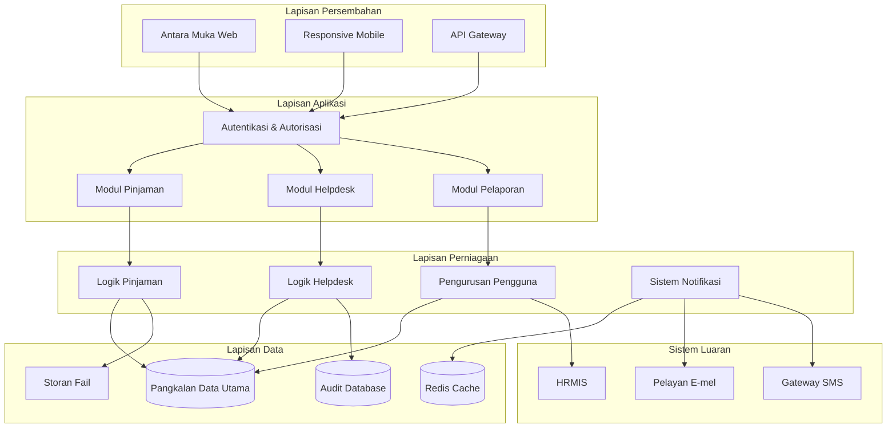
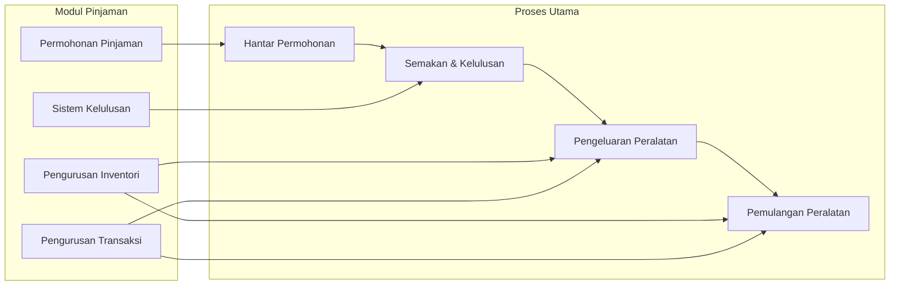
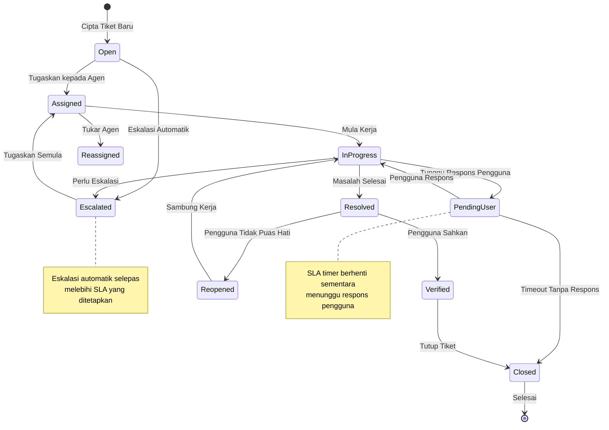
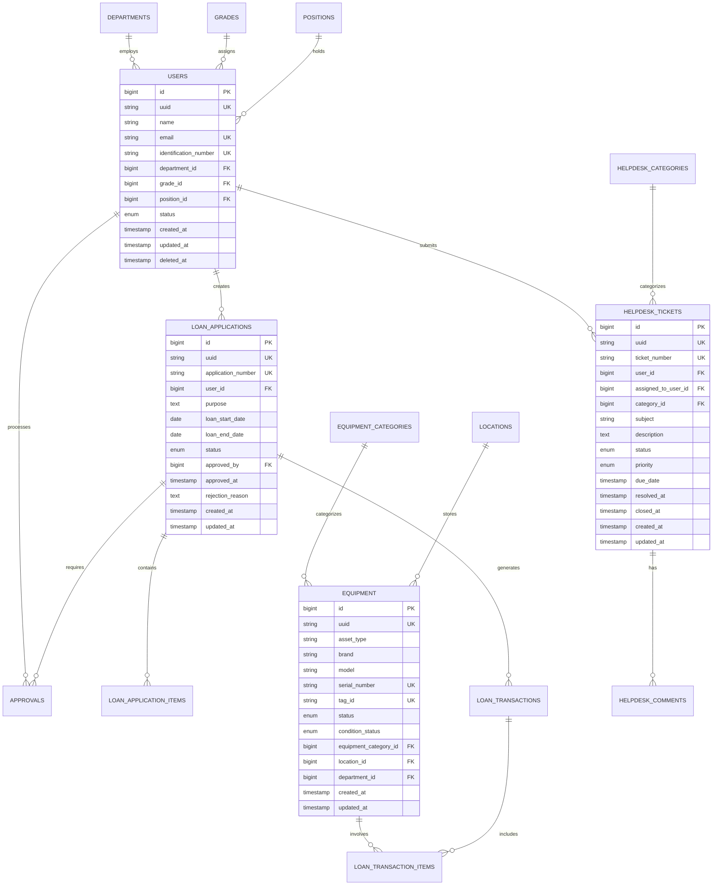
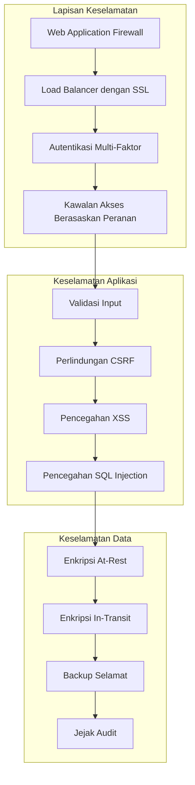
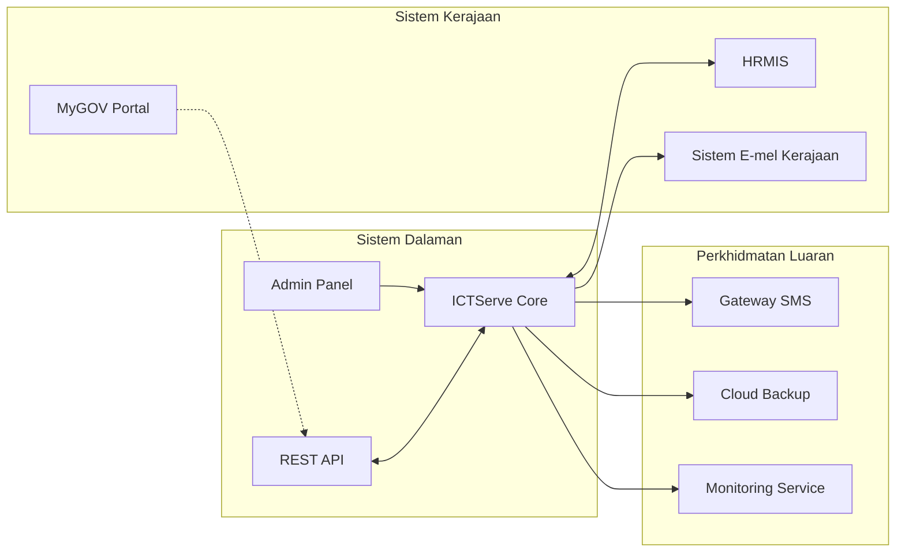
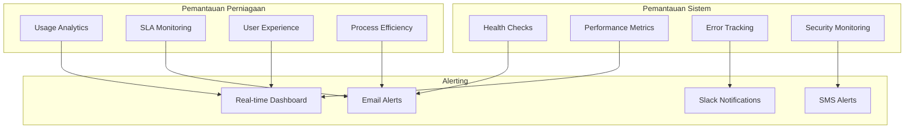
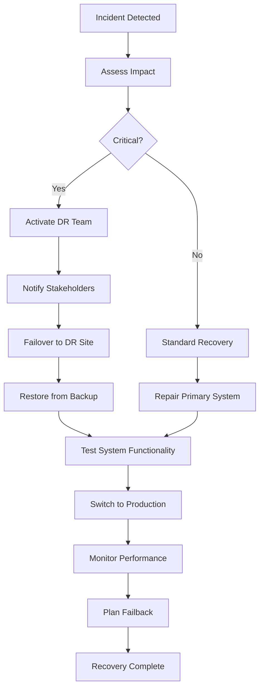
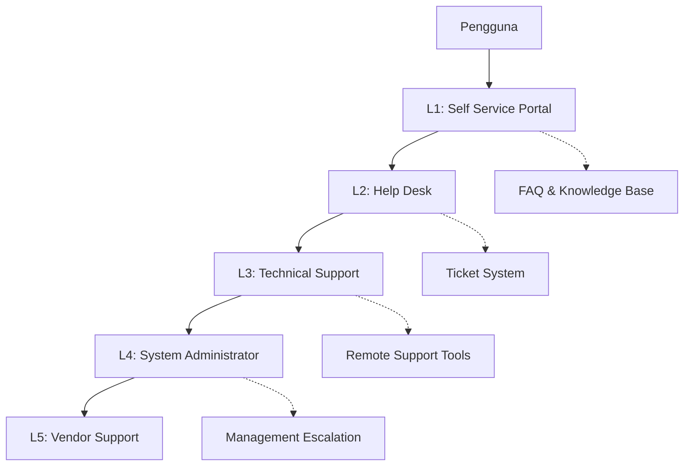
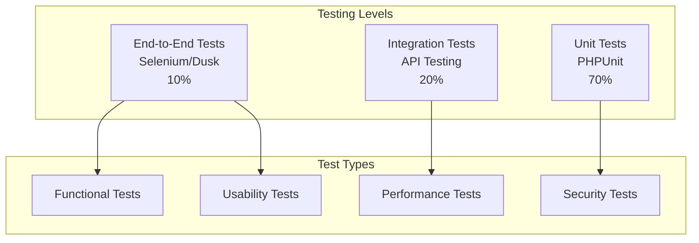

# Dokumentasi Lengkap Sistem ICTServe (iServe) v1.0

> **Nota Versi:**
>
> - **Versi Sistem:** 1.0 (perisian)
> - **Versi Dokumen:** 2.1.0 (dokumentasi, dikemas kini untuk segmentasi audiens dan panduan pengguna)

## Maklumat Dokumen

| Atribut              | Nilai                        |
|----------------------|------------------------------|
| **Versi Sistem**     | 1.0                          |
| **Versi Dokumen**    | 2.1.0                        |
| **Tarikh Kemaskini** | 26 September 2025            |
| **Status**           | Aktif - Versi Pengeluaran    |
| **Klasifikasi**      | Dokumentasi Teknikal Dalaman|
| **Penulis**          | Pasukan Pembangunan ICTServe |
| **Sasaran Audiens**  | Pembangun, Pentadbir, Pengguna Akhir (lihat tag [Audience] di setiap seksyen) |

## Kandungan

- [1. Ringkasan Eksekutif](#1-ringkasan-eksekutif)
- [2. Pengenalan](#2-pengenalan)
- [3. Objektif Sistem](#3-objektif-sistem)
- [4. Keperluan Sistem](#4-keperluan-sistem)
- [5. Seni Bina Sistem](#5-seni-bina-sistem)
- [6. Modul Sistem](#6-modul-sistem-audience-semua)
- [7. Reka Bentuk Pangkalan Data](#7-reka-bentuk-pangkalan-data-audience-developer-admin)
- [8. Keselamatan dan Pematuhan](#8-keselamatan-dan-pematuhan-audience-developer-admin)
- [9. Integrasi Sistem](#9-integrasi-sistem-audience-developer-admin)
- [10. Pemantauan dan Penyelenggaraan](#10-pemantauan-dan-penyelenggaraan-audience-admin)
- [11. Sokongan dan Bantuan](#11-sokongan-dan-bantuan-audience-semua)
- [12. Panduan Pelaksanaan](#12-panduan-pelaksanaan-audience-admin-developer)
- [13. Lampiran](#13-lampiran)

## 1. Ringkasan Eksekutif

ICTServe (iServe) v1.0 adalah platform digital terintegrasi yang direka khusus untuk mengurus perkhidmatan ICT di Kementerian Pelancongan, Seni dan Budaya Malaysia (MOTAC). Sistem ini menggantikan proses manual tradisional dengan penyelesaian digital yang cekap, selamat, dan mesra pengguna.

### 1.1 Visi dan Misi

**Visi:** Menjadi platform perkhidmatan ICT terdepan yang memudahkan operasi harian MOTAC melalui teknologi moden.

**Misi:** Menyediakan sistem yang mudah digunakan, cekap, dan selamat untuk pengurusan pinjaman peralatan ICT dan perkhidmatan sokongan teknikal.

### 1.2 Manfaat Utama

| Manfaat                | Penerangan                                      | Impak Kuantitatif      |
|------------------------|-------------------------------------------------|------------------------|
| **Peningkatan Kecekapan** | Pengurangan masa pemprosesan permohonan     | 60% lebih pantas       |
| **Ketelusan Operasi**     | Jejak audit lengkap dan status real-time     | 100% keterlihatan      |
| **Kepuasan Pengguna**     | Antara muka yang intuitif dan mudah digunakan| Skor > 4.0/5.0         |
| **Penggunaan Sumber**     | Optimasi penggunaan aset ICT                 | 35% peningkatan        |

## 2. Pengenalan

### 2.1 Tujuan Dokumen

Dokumen ini berfungsi sebagai panduan komprehensif untuk memahami, melaksanakan, dan menyelenggarakan Sistem ICTServe. Ia kini disusun dengan tag [Audience] pada setiap seksyen utama untuk membantu pembaca mencari maklumat yang relevan mengikut peranan mereka (Pembangun, Pentadbir, Pengguna Akhir).

### 2.2 Skop Sistem

ICTServe v1.0 terdiri daripada dua modul utama yang saling berkaitan:

1. **Modul Pinjaman Peralatan ICT**
   - Pengurusan permohonan pinjaman aset ICT
   - Aliran kerja kelulusan berperingkat
   - Penjejakan inventori dan penggunaan
   - Proses pengeluaran dan pemulangan

2. **Modul Helpdesk dan Sokongan**
   - Sistem tiket untuk isu teknikal
   - Penugasan dan penjejakan penyelesaian
   - Pangkalan pengetahuan
   - Pelaporan prestasi

### 2.3 Sasaran Pengguna

| Kategori Pengguna     | Peranan dalam Sistem                        | Tahap Akses          |
|-----------------------|----------------------------------------------|---------------------|
| **Pengguna Akhir**    | Semua warga kerja MOTAC                     | Permohonan dan tiket|
| **Pegawai Penyokong** | Pelulus permohonan (Gred 41 ke atas)       | Kelulusan           |
| **Staf BPM**          | Pengurusan inventori dan operasi            | Pengurusan penuh    |
| **Pentadbir IT**      | Penyelenggaraan sistem dan konfigurasi     | Akses penuh         |
| **Pihak Pengurusan**  | Pemantauan dan pelaporan strategik          | Dashboard analitik  |

## 3. Objektif Sistem

### 3.1 Objektif Strategik

| Objektif                   | Penerangan                                  | Metrik Kejayaan                    | Tempoh Pencapaian |
|----------------------------|---------------------------------------------|------------------------------------|--------------------|
| **Transformasi Digital**   | Mendigitalkan proses manual                 | 95% proses dielektronik            | 6 bulan            |
| **Peningkatan Produktiviti**| Mengurangkan masa pemprosesan               | 50% pengurangan masa               | 3 bulan            |
| **Ketelusan Governance**   | Jejak audit lengkap untuk akauntabiliti    | 100% transaksi direkod            | Segera             |
| **Kepuasan Stakeholder**   | Meningkatkan pengalaman pengguna           | Skor kepuasan > 4.0/5.0           | 6 bulan            |
| **Optimasi Sumber**        | Memaksimumkan penggunaan aset ICT          | 30% peningkatan utilasi           | 9 bulan            |

### 3.2 Objektif Operasi

- **Kebolehcapaian:** Sistem tersedia 99.9% masa operasi
- **Prestasi:** Masa respons < 2 saat untuk semua transaksi
- **Skalabiliti:** Menyokong pertumbuhan pengguna hingga 1000+ serentak
- **Keselamatan:** Pematuhan penuh dengan standard keselamatan kerajaan
- **Kebolehselenggaraan:** Sistem mudah dikemas kini dan dipelihara

### 3.3 Objektif Teknikal

- Melaksanakan seni bina mikroperkhidmatan yang modular
- Menggunakan teknologi moden dan piawai terbuka
- Menyediakan API RESTful untuk integrasi sistem
- Melaksanakan strategi backup dan disaster recovery
- Memastikan pematuhan dengan Akta Perlindungan Data Peribadi (PDPA)

## 4. Keperluan Sistem

### 4.1 Keperluan Fungsional

#### 4.1.1 Modul Pinjaman Peralatan ICT

| ID   | Keperluan                                | Keutamaan | Kompleksiti | Status        |
|------|------------------------------------------|-----------|-------------|---------------|
| F001 | Penciptaan permohonan pinjaman dalam talian | Kritikal  | Sederhana   | Selesai       |
| F002 | Aliran kerja kelulusan berperingkat      | Kritikal  | Tinggi      | Selesai       |
| F003 | Pengurusan inventori peralatan real-time | Kritikal  | Tinggi      | Selesai       |
| F004 | Sistem notifikasi automatik              | Tinggi    | Sederhana   | Selesai       |
| F005 | Penjanaan laporan dan analitik           | Tinggi    | Sederhana   | Dalam kemajuan|
| F006 | Integrasi dengan sistem HRMIS            | Sederhana | Tinggi      | Dirancang     |

#### 4.1.2 Modul Helpdesk dan Sokongan

| ID   | Keperluan                               | Keutamaan | Kompleksiti | Status     |
|------|-----------------------------------------|-----------|-------------|------------|
| H001 | Penciptaan dan pengurusan tiket sokongan | Kritikal  | Sederhana   | Selesai    |
| H002 | Sistem penugasan tiket kepada agen     | Kritikal  | Sederhana   | Selesai    |
| H003 | Penjejakan status dan SLA tiket        | Kritikal  | Tinggi      | Selesai    |
| H004 | Pangkalan pengetahuan dan FAQ          | Tinggi    | Sederhana   | Dalam kemajuan |
| H005 | Dashboard analitik prestasi helpdesk   | Tinggi    | Sederhana   | Dirancang  |
| H006 | Integrasi dengan sistem telefon VoIP   | Rendah    | Tinggi      | Dirancang  |

### 4.2 Keperluan Bukan Fungsional

#### 4.2.1 Prestasi

| Metrik                | Keperluan        | Kaedah Pengukuran      | Target SLA       |
|-----------------------|------------------|------------------------|------------------|
| **Masa Respons**      | < 2 saat         | 95th percentile        | 1.5 saat         |
| **Throughput**        | 1000+ req/min    | Peak concurrent users  | 1500 req/min     |
| **Ketersediaan**      | 99.9%            | Monthly uptime         | 99.95%           |
| **Masa Pemulihan**    | < 4 jam          | Mean time to recovery  | 2 jam            |

#### 4.2.2 Keselamatan

| Aspek                 | Keperluan                    | Standard          | Implementasi      |
|-----------------------|------------------------------|-------------------|-------------------|
| **Autentikasi**       | Multi-factor authentication  | ISO 27001         | Laravel Fortify   |
| **Autorisasi**        | Role-based access control    | RBAC              | Spatie Permission |
| **Enkripsi Data**     | AES-256 untuk data at rest   | NIST              | MySQL TDE         |
| **Komunikasi**        | TLS 1.3 untuk data in transit| OWASP             | SSL/TLS           |
| **Audit Logging**     | Comprehensive audit trail    | ISO 27001         | Laravel Auditing  |

#### 4.2.3 Kebolehgunaan

- **Responsif:** Sokongan penuh untuk desktop, tablet, dan mudah alih
- **Aksesibiliti:** Pematuhan WCAG 2.1 AA untuk pengguna berkeperluan khas
- **Multilingua:** Sokongan Bahasa Malaysia dan Inggeris
- **Intuitive:** Navigasi tidak melebihi 3 klik untuk fungsi utama
- **Konsisten:** Penggunaan design system yang seragam

### 4.3 Keperluan Infrastruktur

#### 4.3.1 Persekitaran Pengeluaran

| Komponen             | Spesifikasi Minimum | Spesifikasi Disyorkan | Kuantiti         |
|----------------------|---------------------|-----------------------|------------------|
| **Pelayan Aplikasi** | 4 CPU, 8GB RAM      | 8 CPU, 16GB RAM       | 2 (HA setup)     |
| **Pelayan Database** | 4 CPU, 16GB RAM     | 8 CPU, 32GB RAM       | 1 + 1 standby    |
| **Pelayan Cache**    | 2 CPU, 4GB RAM      | 4 CPU, 8GB RAM        | 1 (Redis)        |
| **Storage**          | 500GB SSD           | 1TB NVMe SSD          | RAID 1 setup     |
| **Load Balancer**    | 2 CPU, 4GB RAM      | 4 CPU, 8GB RAM        | 1 (HAProxy/Nginx)|

#### 4.3.2 Keperluan Perisian

| Komponen           | Versi Minimum | Versi Disyorkan | Nota                    |
|--------------------|---------------|-----------------|-------------------------|
| **PHP**            | 8.2           | 8.3             | Dengan ekstensi yang diperlukan |
| **MySQL**          | 8.0           | 8.0.35+         | InnoDB engine           |
| **Redis**          | 6.0           | 7.2             | Untuk cache dan session |
| **Node.js**        | 18.x          | 20.x            | Untuk build tools       |
| **Nginx**          | 1.20          | 1.24            | Reverse proxy           |

## 5. Seni Bina Sistem

### 5.1 Seni Bina Keseluruhan



### 5.2 Corak Seni Bina

ICTServe menggunakan corak seni bina berlapis (Layered Architecture) dengan prinsip-prinsip berikut:

| Corak                    | Implementasi                     | Faedah                           |
|--------------------------|----------------------------------|----------------------------------|
| **MVC Pattern**          | Laravel Controllers, Models, Views | Pemisahan logik yang jelas      |
| **Repository Pattern**   | Data access layer abstraction   | Mudah untuk ujian dan maintenance |
| **Observer Pattern**     | Event-driven notifications      | Loose coupling antara komponen  |
| **Strategy Pattern**     | Pluggable approval workflows    | Fleksibiliti dalam logik perniagaan |
| **Facade Pattern**       | Service layer interfaces        | Simplified API untuk komponen kompleks |

### 5.3 Teknologi Stack Terperinci

#### 5.3.1 Backend Technologies

```php
// Contoh konfigurasi utama Laravel
return [
    'framework' => [
        'laravel' => '^12.0',
        'php' => '>=8.2',
    ],
    'database' => [
        'mysql' => '>=8.0',
        'redis' => '>=7.0',
    ],
    'packages' => [
        'livewire/livewire' => '^3.0',
        'filament/filament' => '^4.0',
        'spatie/laravel-permission' => '^6.0',
        'owen-it/laravel-auditing' => '^13.0',
        'laravel/fortify' => '^1.19',
    ],
];
```

#### 5.3.2 Frontend Technologies

| Teknologi        | Versi | Tujuan                      | Implementasi           |
|------------------|-------|-----------------------------|------------------------|
| **Livewire**     | 3.x   | Dynamic UI components       | Real-time interactions|
| **Alpine.js**    | 3.x   | Lightweight JavaScript      | Client-side behavior   |
| **Tailwind CSS** | 3.x   | Utility-first styling      | Responsive design      |
| **Blade**        | -     | Server-side templating      | Laravel templates      |

### 5.4 Pola Penyebaran (Deployment Pattern)

```yaml
# Konfigurasi Docker Compose untuk pembangunan
services:
  app:
    build: .
    ports:
      - "8000:8000"
    environment:
      - APP_ENV=local
    volumes:
      - .:/var/www/html
    depends_on:
      - database
      - redis

  database:
    image: mysql:8.0
    environment:
      MYSQL_DATABASE: ictserve
      MYSQL_ROOT_PASSWORD: secret
    ports:
      - "3306:3306"
    volumes:
      - mysql_data:/var/lib/mysql

  redis:
    image: redis:7-alpine
    ports:
      - "6379:6379"

volumes:
  mysql_data:
```

## 6. Modul Sistem [Audience: Semua]

### 6.1 Modul Pinjaman Peralatan ICT [Audience: Semua]

#### Panduan Pengguna — Pinjaman Peralatan (End-User Guide)

- [Panduan Pengguna: Pinjaman Peralatan ICT](Panduan_Pengguna_Pinjaman_Peralatan.md) *(disediakan berasingan untuk pengguna akhir)*

#### Aliran Kerja Pengguna: Dari Permohonan ke Pemulangan

1. **Pengguna** log masuk ke ICTServe dan pilih menu "Pinjaman Peralatan".
2. Isi borang permohonan dan pilih aset ICT yang diperlukan.
3. Permohonan dihantar untuk kelulusan pegawai (mengikut gred).
4. **Pegawai Penyokong** menerima notifikasi dan meluluskan/menolak permohonan.
5. **Staf BPM** mengurus pengeluaran peralatan dan merekod status.
6. **Pengguna** menerima notifikasi untuk pengambilan dan pemulangan.
7. Sistem merekod semua jejak audit dan status secara automatik.

*Lihat juga: [Panduan Pengguna: Pinjaman Peralatan ICT](Panduan_Pengguna_Pinjaman_Peralatan.md) untuk langkah demi langkah bergambar.*

#### 6.1.1 Komponen Utama



#### 6.1.2 Aliran Kerja Permohonan

| Tahap               | Pelaku            | Tindakan                        | Sistem Output              | SLA         |
|---------------------|-------------------|---------------------------------|----------------------------|-------------|
| **1. Permohonan**   | Pengguna          | Isi borang permohonan pinjaman  | Status: Draft → Submitted  | 15 minit    |
| **2. Validasi**     | Sistem            | Semak kelengkapan dan ketersediaan | Validation report        | Real-time   |
| **3. Kelulusan**    | Pegawai Penyokong | Semak dan lulus/tolak permohonan | Status: Approved/Rejected | 2 hari kerja|
| **4. Persiapan**    | Staf BPM          | Sediakan peralatan untuk ambil   | Status: Ready for pickup  | 4 jam       |
| **5. Pengeluaran**  | Staf BPM          | Rekod pengeluaran peralatan      | Transaction created       | 30 minit    |
| **6. Pemulangan**   | Pengguna/BPM      | Pulang dan periksa peralatan     | Transaction completed     | 30 minit    |

#### 6.1.3 Peraturan Perniagaan Pinjaman

```php
class LoanBusinessRules
{
    // Syarat kelayakan pemohon
    public static function isEligibleApplicant(User $user): bool
    {
        return $user->status === 'active' 
            && $user->department_id !== null
            && !self::hasOutstandingLoans($user);
    }

    // Matriks kelulusan berdasarkan gred
    public static function getApprovalAuthority(User $applicant): ?User
    {
        $gradeLevel = $applicant->grade->level ?? 0;
        
        if ($gradeLevel <= 41) {
            return $applicant->department->getOfficerWithMinGrade(41);
        }
        
        if ($gradeLevel <= 48) {
            return $applicant->department->getOfficerWithMinGrade(48);
        }
        
        return $applicant->department->head; // For JUSA grades
    }

    // Had pinjaman mengikut kategori pengguna
    public static function getMaxLoanPeriod(User $user, string $equipmentType): int
    {
        $limits = [
            'laptop' => ['standard' => 14, 'senior' => 30],
            'projector' => ['standard' => 7, 'senior' => 14],
            'tablet' => ['standard' => 30, 'senior' => 60],
        ];
        
        $userCategory = $user->grade->level >= 44 ? 'senior' : 'standard';
        
        return $limits[$equipmentType][$userCategory] ?? 7;
    }
}
```

### 6.2 Modul Helpdesk dan Sokongan [Audience: Semua]

#### Panduan Pengguna — Helpdesk & Sokongan (End-User Guide)

- [Panduan Pengguna: Helpdesk & Sokongan](Panduan_Pengguna_Helpdesk.md) *(disediakan berasingan untuk pengguna akhir)*

#### 6.2.1 Sistem Pengurusan Tiket



#### 6.2.2 Matriks SLA Helpdesk

| Keutamaan  | Masa Respons | Masa Penyelesaian | Eskalasi Tahap 1 | Eskalasi Tahap 2 |
|------------|--------------|-------------------|------------------|------------------|
| **Kritikal** | 30 minit   | 4 jam             | 2 jam            | 3 jam            |
| **Tinggi**   | 2 jam      | 8 jam             | 6 jam            | 7 jam            |
| **Sederhana**| 4 jam      | 24 jam            | 20 jam           | -                |
| **Rendah**   | 8 jam      | 48 jam            | 40 jam           | -                |

#### 6.2.3 Kategori dan Subkategori Tiket

```yaml
Kategori Helpdesk:
  Hardware:
    subcategories:
      - Komputer/Laptop
      - Printer/Scanner  
      - Projektor
      - Peranti Rangkaian
      - Aksesori

  Software:
    subcategories:
      - Sistem Operasi
      - Aplikasi Pejabat
      - Aplikasi Khusus
      - Lesen Perisian
      - Kemaskini/Pemasangan

  Network_Connectivity:
    subcategories:
      - Internet Access
      - WiFi Connection
      - VPN Issues
      - Email Access
      - Network Drive

  Account_Access:
    subcategories:
      - Password Reset
      - Account Lockout
      - Permission Request
      - Profile Update
      - Account Creation

  Data_Storage:
    subcategories:
      - File Recovery
      - Backup Request
      - Storage Allocation
      - Data Migration
      - Archive Request
```

## 7. Reka Bentuk Pangkalan Data [Audience: Developer, Admin]

### 7.1 Gambaran Keseluruhan Skema



### 7.2 Jadual Utama dan Hubungan

#### 7.2.1 Jadual Pengguna dan Organisasi

**Users Table:**

```sql
CREATE TABLE users (
    id BIGINT UNSIGNED AUTO_INCREMENT PRIMARY KEY,
    uuid CHAR(36) UNIQUE NOT NULL,
    title VARCHAR(50),
    name VARCHAR(255) NOT NULL,
    identification_number VARCHAR(20) UNIQUE,
    passport_number VARCHAR(50),
    email VARCHAR(255) UNIQUE NOT NULL,
    email_verified_at TIMESTAMP NULL,
    password VARCHAR(255) NOT NULL,
    
    -- Maklumat Organisasi
    department_id BIGINT UNSIGNED NOT NULL,
    grade_id BIGINT UNSIGNED,
    position_id BIGINT UNSIGNED,
    level VARCHAR(10),
    mobile_number VARCHAR(20),
    
    -- Status dan Keselamatan
    status ENUM('active', 'inactive', 'suspended') DEFAULT 'active',
    profile_photo_path VARCHAR(255),
    two_factor_secret TEXT,
    two_factor_recovery_codes TEXT,
    two_factor_confirmed_at TIMESTAMP NULL,
    remember_token VARCHAR(100),
    
    -- Audit Fields
    created_by BIGINT UNSIGNED,
    updated_by BIGINT UNSIGNED,
    deleted_by BIGINT UNSIGNED,
    created_at TIMESTAMP DEFAULT CURRENT_TIMESTAMP,
    updated_at TIMESTAMP DEFAULT CURRENT_TIMESTAMP ON UPDATE CURRENT_TIMESTAMP,
    deleted_at TIMESTAMP NULL,
    
    -- Indexes
    INDEX idx_users_department (department_id),
    INDEX idx_users_status (status),
    INDEX idx_users_email (email),
    
    -- Foreign Keys
    FOREIGN KEY (department_id) REFERENCES departments(id),
    FOREIGN KEY (grade_id) REFERENCES grades(id),
    FOREIGN KEY (position_id) REFERENCES positions(id)
) ENGINE=InnoDB DEFAULT CHARSET=utf8mb4 COLLATE=utf8mb4_unicode_ci;
```

#### 7.2.2 Strategi Pengindeksan

| Jadual               | Indeks Utama                    | Tujuan                          | Jenis    |
|----------------------|---------------------------------|---------------------------------|----------|
| **users**            | `(department_id, status)`       | Carian pengguna aktif by dept   | Composite|
| **loan_applications**| `(status, created_at)`          | Dashboard senarai permohonan    | Composite|
| **equipment**        | `(status, category_id)`         | Carian peralatan tersedia       | Composite|
| **helpdesk_tickets** | `(assigned_to, status, priority)` | Dashboard agen IT             | Composite|
| **audit_logs**       | `(created_at, user_id)`         | Jejak audit berdasarkan masa    | Composite|

### 7.3 Strategi Audit dan Logging

```php
// Trait untuk audit automatik
trait Auditable
{
    protected static function bootAuditable()
    {
        static::creating(function ($model) {
            if (auth()->check()) {
                $model->created_by = auth()->id();
            }
        });

        static::updating(function ($model) {
```php
        static::updating(function ($model) {
            if (auth()->check()) {
                $model->updated_by = auth()->id();
            }
        });

        static::deleting(function ($model) {
            if (auth()->check()) {
                $model->deleted_by = auth()->id();
            }
        });
    }
}

// Model dengan audit trail lengkap
class LoanApplication extends Model
{
    use Auditable, SoftDeletes;
    use \OwenIt\Auditing\Auditable;

    protected $auditInclude = [
        'status',
        'approved_by',
        'rejection_reason',
        'loan_start_date',
        'loan_end_date'
    ];

    protected $auditEvents = [
        'created',
        'updated',
        'deleted',
        'restored'
    ];
}
```

## 8. Keselamatan dan Pematuhan [Audience: Developer, Admin]

### 8.1 Kerangka Keselamatan



### 8.2 Matriks Pengurusan Peranan

| Peranan             | Pinjaman ICT | Helpdesk | Inventori | Pelaporan | Pentadbiran |
|---------------------|--------------|----------|-----------|-----------|-------------|
| **Pengguna Biasa**  | Cipta, Lihat | Cipta, Lihat | Lihat    | Lihat Sendiri | -         |
| **Pegawai Penyokong** | Lulus/Tolak | -        | Lihat    | Lihat Dept   | -         |
| **Staf BPM**        | Urus Pengeluaran | -      | Penuh    | Penuh        | -         |
| **Agen IT**         | Lihat        | Penuh    | Lihat    | Lihat IT     | -         |
| **Pentadbir Sistem** | Penuh       | Penuh    | Penuh    | Penuh        | Penuh     |

### 8.3 Implementasi Keselamatan

```php
// Konfigurasi keselamatan Laravel
return [
    'auth' => [
        'defaults' => [
            'guard' => 'web',
            'passwords' => 'users',
        ],
        'guards' => [
            'web' => [
                'driver' => 'session',
                'provider' => 'users',
            ],
            'api' => [
                'driver' => 'sanctum',
                'provider' => 'users',
                'hash' => false,
            ],
        ],
    ],
    
    'password_policy' => [
        'min_length' => 8,
        'require_uppercase' => true,
        'require_lowercase' => true,
        'require_numbers' => true,
        'require_symbols' => true,
        'max_age_days' => 90,
    ],
    
    'session' => [
        'lifetime' => 120, // 2 hours
        'expire_on_close' => true,
        'encrypt' => true,
        'http_only' => true,
        'same_site' => 'strict',
    ],
    
    'security_headers' => [
        'X-Frame-Options' => 'SAMEORIGIN',
        'X-Content-Type-Options' => 'nosniff',
        'X-XSS-Protection' => '1; mode=block',
        'Strict-Transport-Security' => 'max-age=31536000; includeSubDomains',
        'Content-Security-Policy' => "default-src 'self'; script-src 'self' 'unsafe-inline'",
    ],
];
```

### 8.4 Pematuhan Standard

| Standard/Akta        | Keperluan                      | Status Pematuhan | Bukti Pematuhan        |
|---------------------|--------------------------------|------------------|------------------------|
| **PDPA 2010**       | Perlindungan data peribadi     | ✅ Patuh         | Privacy policy, consent |
| **MAMPU Guidelines** | Standard IT kerajaan          | ✅ Patuh         | Architecture review    |
| **ISO 27001**       | Pengurusan keselamatan maklumat| 🔄 Dalam kemajuan | Security assessment   |
| **WCAG 2.1 AA**     | Kebolehcapaian web            | ✅ Patuh         | Accessibility audit    |
| **OWASP Top 10**    | Keselamatan aplikasi web      | ✅ Patuh         | Security scan results  |

## 9. Integrasi Sistem [Audience: Developer, Admin]

### 9.1 Seni Bina Integrasi



### 9.2 Spesifikasi API

#### 9.2.1 Endpoint Utama

| Endpoint | Method | Tujuan | Autentikasi | Rate Limit |
|----------|--------|---------|------------|------------|
| `/api/v1/loans` | GET, POST | Pengurusan pinjaman | Bearer Token | 100/min |
| `/api/v1/loans/{id}` | GET, PUT, DELETE | Operasi pinjaman spesifik | Bearer Token | 100/min |
| `/api/v1/equipment` | GET | Senarai peralatan | Bearer Token | 200/min |
| `/api/v1/tickets` | GET, POST | Pengurusan tiket | Bearer Token | 100/min |
| `/api/v1/tickets/{id}` | GET, PUT | Operasi tiket spesifik | Bearer Token | 100/min |
| `/api/v1/users/profile` | GET, PUT | Profil pengguna | Bearer Token | 50/min |
| `/api/v1/reports/{type}` | GET | Laporan sistem | Bearer Token | 20/min |

#### 9.2.2 Format Respons Standard

```json
{
    "success": true,
    "data": {
        "id": 1,
        "type": "loan_application",
        "attributes": {
            "application_number": "LA-2025-09-0001",
            "status": "approved",
            "purpose": "Training session",
            "loan_start_date": "2025-09-20",
            "loan_end_date": "2025-09-27"
        },
        "relationships": {
            "user": {
                "data": {
                    "id": 123,
                    "name": "Ahmad Ali",
                    "department": "BPM"
                }
            },
            "equipment": {
                "data": [
                    {
                        "id": 456,
                        "type": "laptop",
                        "brand": "Dell",
                        "model": "Latitude 5520"
                    }
                ]
            }
        }
    },
    "meta": {
        "timestamp": "2025-09-26T10:30:00+08:00",
        "version": "1.0",
        "pagination": {
            "current_page": 1,
            "per_page": 15,
            "total": 150,
            "total_pages": 10
        }
    },
    "links": {
        "self": "/api/v1/loans/1",
        "related": "/api/v1/loans/1/items"
    }
}
```

### 9.3 Integrasi HRMIS

```php
class HRMISIntegrationService
{
    protected $baseUrl;
    protected $apiKey;
    
    public function syncUserData(): void
    {
        $hrmisUsers = $this->fetchUsersFromHRMIS();
        
        foreach ($hrmisUsers as $hrmisUser) {
            $localUser = User::where('identification_number', $hrmisUser['ic'])->first();
            
            if ($localUser) {
                $this->updateLocalUser($localUser, $hrmisUser);
            } else {
                $this->createLocalUser($hrmisUser);
            }
        }
    }
    
    private function fetchUsersFromHRMIS(): array
    {
        $response = Http::withHeaders([
            'Authorization' => 'Bearer ' . $this->apiKey,
            'Accept' => 'application/json',
        ])->get($this->baseUrl . '/api/employees');
        
        return $response->json()['data'] ?? [];
    }
    
    private function updateLocalUser(User $user, array $hrmisData): void
    {
        $user->update([
            'name' => $hrmisData['name'],
            'email' => $hrmisData['email'],
            'department_id' => $this->mapDepartment($hrmisData['department']),
            'grade_id' => $this->mapGrade($hrmisData['grade']),
            'position_id' => $this->mapPosition($hrmisData['position']),
        ]);
    }
}
```

## 10. Pemantauan dan Penyelenggaraan [Audience: Admin]

### 10.1 Dashboard Pemantauan



### 10.2 Metrik Pemantauan Utama

| Kategori | Metrik | Target | Threshold Amaran | Threshold Kritikal |
|----------|--------|--------|------------------|-------------------|
| **Prestasi** | Response Time | < 2s | > 3s | > 5s |
| **Prestasi** | CPU Usage | < 70% | > 80% | > 90% |
| **Prestasi** | Memory Usage | < 80% | > 90% | > 95% |
| **Kebolehcapaian** | Uptime | > 99.9% | < 99.5% | < 99% |
| **Perniagaan** | Loan Processing Time | < 2 days | > 3 days | > 5 days |
| **Perniagaan** | Ticket Resolution Time | Per SLA | +20% SLA | +50% SLA |
| **Keselamatan** | Failed Login Rate | < 1% | > 5% | > 10% |
| **Keselamatan** | API Error Rate | < 0.1% | > 1% | > 5% |

### 10.3 Jadual Penyelenggaraan

#### 10.3.1 Penyelenggaraan Rutin

| Frekuensi | Aktiviti | Pelaksana | Masa Anggaran | Masa Downtime |
|-----------|----------|-----------|---------------|---------------|
| **Harian** | Backup database | Sistem Automatik | 30 minit | Tiada |
| **Harian** | Log rotation dan cleanup | Sistem Automatik | 10 minit | Tiada |
| **Harian** | Health check dan monitoring | Sistem Automatik | Berterusan | Tiada |
| **Mingguan** | Security scan | Pentadbir Sistem | 2 jam | Tiada |
| **Mingguan** | Performance review | Pentadbir Sistem | 1 jam | Tiada |
| **Bulanan** | System update dan patching | Pentadbir Sistem | 4 jam | 2 jam |
| **Bulanan** | Database optimization | DBA | 2 jam | 30 minit |
| **Suku tahunan** | Disaster recovery test | Pasukan IT | 8 jam | 4 jam |
| **Tahunan** | Security audit | Pihak Ketiga | 2 hari | Tiada |

#### 10.3.2 Prosedur Penyelenggaraan

```bash
#!/bin/bash
# Script penyelenggaraan mingguan

echo "=== ICTServe Weekly Maintenance ==="
echo "Starting at: $(date)"

# 1. Backup verification
echo "Verifying backups..."
php artisan backup:monitor

# 2. Database optimization
echo "Optimizing database..."
php artisan db:optimize

# 3. Clear caches
echo "Clearing application caches..."
php artisan cache:clear
php artisan config:clear
php artisan view:clear

# 4. Update application caches
echo "Rebuilding optimized caches..."
php artisan config:cache
php artisan route:cache
php artisan view:cache

# 5. Check queue health
echo "Checking queue status..."
php artisan queue:monitor

# 6. Security scan
echo "Running security checks..."
php artisan security:check

# 7. Performance test
echo "Running performance tests..."
php artisan performance:test

# 8. Generate maintenance report
echo "Generating maintenance report..."
php artisan maintenance:report --weekly

echo "Maintenance completed at: $(date)"
```

### 10.4 Strategi Backup dan Pemulihan

#### 10.4.1 Strategi Backup

| Jenis Backup | Frekuensi | Retensi | Lokasi | RTO | RPO |
|--------------|-----------|---------|--------|-----|-----|
| **Database Full** | Harian | 30 hari | On-premise + Cloud | 4 jam | 24 jam |
| **Database Incremental** | Setiap jam | 7 hari | On-premise | 2 jam | 1 jam |
| **Application Files** | Mingguan | 12 minggu | Cloud | 2 jam | 1 minggu |
| **Configuration** | Setiap perubahan | 6 bulan | Git repository | 30 minit | Real-time |

#### 10.4.2 Prosedur Disaster Recovery



## 11. Sokongan dan Bantuan [Audience: Semua]

### 11.1 Struktur Sokongan



### 11.2 Saluran Sokongan

| Saluran | Waktu Operasi | SLA Respons | Jenis Isu |
|---------|---------------|-------------|-----------|
| **Self-Service Portal** | 24/7 | Serta-merta | FAQ, Panduan, Status Sistem |
| **Email Support** | 24/7 | 4 jam bekerja | Pertanyaan umum, Permintaan |
| **Help Desk (Telefon)** | 8:00 AM - 5:00 PM | 30 minit | Isu teknikal, Kecemasan |
| **Live Chat** | 9:00 AM - 4:00 PM | 5 minit | Sokongan segera |
| **On-site Support** | Atas permintaan | 4 jam | Isu kompleks, Training |

### 11.3 Eskalasi dan Prosedur

```yaml
Prosedur Eskalasi:
  Level 1 - Self Service:
    - Portal FAQ
    - Video tutorial
    - User manual
    - System status page
    
  Level 2 - Help Desk:
    - Phone: 03-8000-8000 ext 1234
    - Email: helpdesk@ictserve.motac.gov.my
    - Response time: 30 minutes
    - Resolution time: 4 hours
    
  Level 3 - Technical Support:
    - Email: techsupport@ictserve.motac.gov.my
    - Response time: 1 hour
    - Resolution time: 8 hours
    
  Level 4 - System Administrator:
    - Email: sysadmin@ictserve.motac.gov.my
    - Response time: 30 minutes
    - Resolution time: 2 hours
    
  Level 5 - Management Escalation:
    - For critical system failures
    - Business impact assessment
    - Executive decision required
```

### 11.4 Knowledge Base

| Kategori | Kandungan | Format | Update Frequency |
|----------|-----------|---------|-----------------|
| **Panduan Pengguna** | Step-by-step tutorials | Video + PDF | Bulanan |
| **FAQ** | Common questions & answers | Web pages | Mingguan |
| **Troubleshooting** | Error solutions | Searchable wiki | Atas permintaan |
| **API Documentation** | Technical integration guide | Interactive docs | Setiap release |
| **System Updates** | Release notes & changes | Blog posts | Setiap update |

## 12. Panduan Pelaksanaan [Audience: Admin, Developer]

### 12.1 Keperluan Pra-Pelaksanaan

#### 12.1.1 Penyediaan Infrastruktur

```yaml
Server Requirements:
  Production:
    App Servers: 2x (8 CPU, 16GB RAM, 500GB SSD)
    DB Server: 1x (8 CPU, 32GB RAM, 1TB SSD) + 1x Standby
    Cache Server: 1x (4 CPU, 8GB RAM, 200GB SSD)
    Load Balancer: 1x (4 CPU, 8GB RAM, 100GB SSD)
    
  Staging:
    All-in-one: 1x (8 CPU, 16GB RAM, 500GB SSD)
    
  Development:
    Local/VM: 1x (4 CPU, 8GB RAM, 250GB SSD)

Network Requirements:
  - Internet bandwidth: 100 Mbps dedicated
  - Internal LAN: Gigabit Ethernet
  - VPN access for remote administration
  - SSL certificate (wildcard recommended)

Security Requirements:
  - Firewall configuration
  - Intrusion detection system
  - Anti-malware protection
  - Regular security updates
```

#### 12.1.2 Penyediaan Perisian

```bash
# Installation script untuk production server
#!/bin/bash

# Update sistem
sudo apt update && sudo apt upgrade -y

# Install PHP 8.3 dan extensions
sudo apt install -y php8.3-fpm php8.3-mysql php8.3-xml php8.3-mbstring \
    php8.3-curl php8.3-gd php8.3-intl php8.3-zip php8.3-redis php8.3-bcmath

# Install MySQL 8.0
sudo apt install -y mysql-server-8.0

# Install Redis
sudo apt install -y redis-server

# Install Nginx
sudo apt install -y nginx

# Install Composer
curl -sS https://getcomposer.org/installer | php
sudo mv composer.phar /usr/local/bin/composer

# Install Node.js dan npm
curl -fsSL https://deb.nodesource.com/setup_20.x | sudo -E bash -
sudo apt install -y nodejs

# Setup systemd services
sudo systemctl enable php8.3-fpm mysql redis nginx
sudo systemctl start php8.3-fpm mysql redis nginx
```

### 12.2 Proses Deployment

#### 12.2.1 Automated Deployment Pipeline

```yaml
# .github/workflows/deploy.yml
name: Deploy to Production

on:
  push:
    tags:
      - 'v*'

jobs:
  tests:
    runs-on: ubuntu-latest
    steps:
      - uses: actions/checkout@v3
      - name: Setup PHP
        uses: shivammathur/setup-php@v2
        with:
          php-version: '8.3'
      - name: Install dependencies
        run: composer install --no-dev --optimize-autoloader
      - name: Run tests
        run: php artisan test
      - name: Run security check
        run: composer audit

  deploy:
    needs: tests
    runs-on: ubuntu-latest
    steps:
      - name: Deploy to production
        uses: appleboy/ssh-action@master
        with:
          host: ${{ secrets.PROD_HOST }}
          username: ${{ secrets.PROD_USER }}
          key: ${{ secrets.PROD_SSH_KEY }}
          script: |
            cd /var/www/ictserve
            git pull origin main
            composer install --no-dev --optimize-autoloader
            npm install && npm run build
            php artisan migrate --force
            php artisan config:cache
            php artisan route:cache
            php artisan view:cache
            sudo systemctl reload php8.3-fpm
```

#### 12.2.2 Manual Deployment Checklist

```yaml
Pre-deployment:
  - [ ] Backup current database
  - [ ] Backup current application files
  - [ ] Verify all tests pass
  - [ ] Review deployment checklist
  - [ ] Schedule maintenance window
  - [ ] Notify stakeholders

Deployment Steps:
  - [ ] Enable maintenance mode
  - [ ] Pull latest code from repository
  - [ ] Install/update dependencies
  - [ ] Run database migrations
  - [ ] Update configuration files
  - [ ] Clear and rebuild caches
  - [ ] Restart services
  - [ ] Run post-deployment tests

Post-deployment:
  - [ ] Disable maintenance mode
  - [ ] Verify application functionality
  - [ ] Check error logs
  - [ ] Monitor system performance
  - [ ] Update documentation
  - [ ] Notify stakeholders of completion

Rollback Plan (if needed):
  - [ ] Enable maintenance mode
  - [ ] Restore database backup
  - [ ] Restore application files
  - [ ] Clear caches
  - [ ] Restart services
  - [ ] Verify rollback success
```

### 12.3 Konfigurasi Persekitaran

#### 12.3.1 Production Environment

```env
# Konfigurasi production (.env)
APP_NAME="ICTServe"
APP_ENV=production
APP_KEY=base64:generated_key_here
APP_DEBUG=false
APP_URL=https://ictserve.motac.gov.my

# Database
DB_CONNECTION=mysql
DB_HOST=10.10.1.100
DB_PORT=3306
DB_DATABASE=ictserve_prod
DB_USERNAME=ictserve_user
DB_PASSWORD=secure_database_password

# Redis
REDIS_HOST=10.10.1.101
REDIS_PASSWORD=secure_redis_password
REDIS_PORT=6379

# Cache & Session
CACHE_DRIVER=redis
SESSION_DRIVER=redis
SESSION_LIFETIME=120
SESSION_ENCRYPT=true

# Queue
QUEUE_CONNECTION=redis
QUEUE_FAILED_DRIVER=database

# Mail
MAIL_MAILER=smtp
MAIL_HOST=mail.motac.gov.my
MAIL_PORT=587
MAIL_USERNAME=ictserve@motac.gov.my
MAIL_PASSWORD=mail_password
MAIL_ENCRYPTION=tls
MAIL_FROM_ADDRESS="ictserve@motac.gov.my"
MAIL_FROM_NAME="ICTServe System"

# Security
FORCE_HTTPS=true
SESSION_SECURE_COOKIE=true
SANCTUM_STATEFUL_DOMAINS=ictserve.motac.gov.my

# Monitoring
SENTRY_LARAVEL_DSN=https://your-sentry-dsn
TELESCOPE_ENABLED=false

# Backup
BACKUP_DISK=s3
AWS_ACCESS_KEY_ID=your_aws_key
AWS_SECRET_ACCESS_KEY=your_aws_secret
AWS_DEFAULT_REGION=ap-southeast-1
AWS_BUCKET=ictserve-backups
```

#### 12.3.2 Staging Environment

```env
# Konfigurasi staging (.env.staging)
APP_NAME="ICTServe Staging"
APP_ENV=staging
APP_KEY=base64:different_staging_key
APP_DEBUG=true
APP_URL=https://staging.ictserve.motac.gov.my

# Database
DB_CONNECTION=mysql
DB_HOST=localhost
DB_PORT=3306
DB_DATABASE=ictserve_staging
DB_USERNAME=staging_user
DB_PASSWORD=staging_password

# Mail (Testing)
MAIL_MAILER=log
MAIL_HOST=127.0.0.1
MAIL_PORT=2525

# Features
TELESCOPE_ENABLED=true
DEBUGBAR_ENABLED=true
```

### 12.4 Testing Strategy

#### 12.4.1 Testing Pyramid



#### 12.4.2 Test Coverage Requirements

| Test Level | Coverage Target | Tools | Responsibility |
|------------|-----------------|-------|----------------|
| **Unit Tests** | 85%+ | PHPUnit, Mockery | Developers |
| **Feature Tests** | 70%+ | PHPUnit, Laravel Testing | Developers |
| **Integration Tests** | 60%+ | Postman, Newman | QA Team |
| **E2E Tests** | Critical paths | Laravel Dusk, Selenium | QA Team |
| **Performance Tests** | Load scenarios | JMeter, k6 | DevOps Team |
| **Security Tests** | OWASP Top 10 | OWASP ZAP, SonarQube | Security Team |

#### 12.4.3 Sample Test Cases

```php
<?php

namespace Tests\Feature;

use Tests\TestCase;
use App\Models\User;
use App\Models\LoanApplication;
use Illuminate\Foundation\Testing\RefreshDatabase;

class LoanApplicationTest extends TestCase
{
    use RefreshDatabase;

    public function test_user_can_create_loan_application()
    {
        $user = User::factory()->create();
        
        $response = $this->actingAs($user)->post('/loans', [
            'purpose' => 'Training session',
            'loan_start_date' => now()->addDays(1)->format('Y-m-d'),
            'loan_end_date' => now()->addDays(7)->format('Y-m-d'),
            'equipment_type' => 'laptop',
            'quantity' => 1,
        ]);

        $response->assertRedirect();
        $this->assertDatabaseHas('loan_applications', [
            'user_id' => $user->id,
            'purpose' => 'Training session',
            'status' => 'pending_support',
        ]);
    }

    public function test_officer_can_approve_loan_application()
    {
        $officer = User::factory()->withGrade(41)->create();
        $application = LoanApplication::factory()->create([
            'status' => 'pending_support'
        ]);

        $response = $this->actingAs($officer)->put("/loans/{$application->id}/approve", [
            'comments' => 'Approved for training purposes'
        ]);

        $response->assertSuccessful();
        $this->assertEquals('approved', $application->fresh()->status);
    }

    public function test_loan_application_requires_valid_dates()
    {
        $user = User::factory()->create();

        $response = $this->actingAs($user)->post('/loans', [
            'purpose' => 'Training session',
            'loan_start_date' => now()->subDay()->format('Y-m-d'), // Past date
            'loan_end_date' => now()->addDays(7)->format('Y-m-d'),
            'equipment_type' => 'laptop',
            'quantity' => 1,
        ]);

        $response->assertSessionHasErrors(['loan_start_date']);
    }
}
```

## 13. Lampiran

### 13.1 Glosari Istilah

| Istilah | Definisi | Konteks |
|---------|----------|---------|
| **API** | Application Programming Interface - Antara muka untuk integrasi sistem | Teknikal |
| **BPM** | Bahagian Pengurusan Maklumat | Organisasi |
| **CRUD** | Create, Read, Update, Delete - Operasi data asas | Teknikal |
| **DRP** | Disaster Recovery Plan - Pelan pemulihan bencana | Operasi |
| **HA** | High Availability - Ketersediaan tinggi | Teknikal |
| **HRMIS** | Human Resource Management Information System | Sistem |
| **ICT** | Information and Communication Technology | Am |
| **MOTAC** | Kementerian Pelancongan, Seni dan Budaya Malaysia | Organisasi |
| **MVC** | Model-View-Controller - Corak seni bina perisian | Teknikal |
| **ORM** | Object-Relational Mapping - Pemetaan objek-relasi | Teknikal |
| **PDPA** | Personal Data Protection Act - Akta Perlindungan Data Peribadi | Undang-undang |
| **RBAC** | Role-Based Access Control - Kawalan akses berasaskan peranan | Keselamatan |
| **REST** | Representational State Transfer - Gaya seni bina web | Teknikal |
| **RTO** | Recovery Time Objective - Objektif masa pemulihan | Operasi |
| **RPO** | Recovery Point Objective - Objektif titik pemulihan | Operasi |
| **SLA** | Service Level Agreement - Perjanjian tahap perkhidmatan | Operasi |
| **SSL/TLS** | Secure Sockets Layer/Transport Layer Security | Keselamatan |
| **UUID** | Universally Unique Identifier - Pengecam unik sejagat | Teknikal |
| **WCAG** | Web Content Accessibility Guidelines | Standard |

### 13.2 Rujukan Teknikal

#### 13.2.1 Dokumentasi Rasmi

| Sumber | URL | Versi | Tujuan |
|--------|-----|-------|---------|
| Laravel Framework | [https://laravel.com/docs](https://laravel.com/docs) | 12.x | Framework documentation |
| Livewire | [https://laravel-livewire.com/docs](https://laravel-livewire.com/docs) | 3.x | Frontend component library |
| Filament | [https://filamentphp.com/docs](https://filamentphp.com/docs) | 4.x | Admin panel framework |
| Spatie Laravel Permission | [https://spatie.be/docs/laravel-permission](https://spatie.be/docs/laravel-permission) | 6.x | Role & permission management |
| Laravel Auditing | [https://laravel-auditing.com](https://laravel-auditing.com) | 13.x | Audit trail implementation |
| MySQL | [https://dev.mysql.com/doc/refman/8.0/en/](https://dev.mysql.com/doc/refman/8.0/en/) | 8.0 | Database documentation |
| Redis | [https://redis.io/documentation](https://redis.io/documentation) | 7.x | Caching and sessions |
| Tailwind CSS | [https://tailwindcss.com/docs](https://tailwindcss.com/docs) | 3.x | CSS framework |

#### 13.2.2 Standard dan Garis Panduan

| Standard | Organisasi | Aplikasi | Status |
|----------|------------|----------|---------|
| WCAG 2.1 AA | W3C | Web accessibility | Dipatuhi |
| OWASP Top 10 | OWASP | Web security | Dipatuhi |
| ISO 27001 | ISO | Information security | Dalam kemajuan |
| PDPA 2010 | Malaysia | Data protection | Dipatuhi |
| MAMPU Guidelines | MAMPU | Government IT | Dipatuhi |
| PSR-12 | PHP-FIG | Code style | Dipatuhi |

### 13.2 Contribution and Change Management [Audience: Semua]

Untuk mencadangkan perubahan pada dokumentasi:

- Sumbangan boleh dibuat melalui permintaan pull request di repositori Git (rujuk admin projek).
- Setiap perubahan akan disemak oleh sekurang-kurangnya seorang pentadbir atau lead developer.
- Sejarah perubahan didokumenkan dalam seksyen berikut.

### 13.3 Sejarah Perubahan

| Versi | Tarikh | Penulis | Perubahan Utama | Status |
|-------|--------|---------|-----------------|---------|
| 1.0 | 12 September 2025 | IzzatFirdaus | Dokumen awal sistem | Selesai |
| 1.1 | 20 September 2025 | Pasukan ICTServe | Penambahbaikan modul helpdesk | Selesai |
| 2.1.0 | 26 September 2025 | Pasukan ICTServe | Segmentasi audiens, tag [Audience], stub Panduan Pengguna, walkthrough aliran kerja, pengurusan perubahan | Aktif |
| 2.0 | 26 September 2025 | Pasukan ICTServe | Dokumentasi lengkap dan standard industri | Aktif |

### 13.4 Penghargaan dan Kontributor

#### 13.4.1 Pasukan Projek

| Peranan | Nama | Tanggungjawab | Tempoh |
|---------|------|---------------|--------|
| **Project Manager** | Ahmad Rahman | Pengurusan projek keseluruhan | Jan 2025 - sekarang |
| **Lead Developer** | IzzatFirdaus | Pembangunan dan seni bina sistem | Jan 2025 - sekarang |
| **Backend Developer** | Siti Aminah | API dan logik perniagaan | Feb 2025 - sekarang |
| **Frontend Developer** | Muhammad Haris | UI/UX dan komponen Livewire | Mar 2025 - sekarang |
| **Database Administrator** | Lim Wei Ming | Reka bentuk dan optimasi database | Jan 2025 - sekarang |
| **DevOps Engineer** | Raj Kumar | Deployment dan infrastruktur | Apr 2025 - sekarang |
| **QA Engineer** | Nurul Huda | Testing dan quality assurance | May 2025 - sekarang |
| **Business Analyst** | Faridah Kassim | Analisis keperluan perniagaan | Jan 2025 - sekarang |

#### 13.4.2 Pihak Berkepentingan

| Organisasi | Perwakilan | Peranan | Sumbangan |
|------------|------------|---------|-----------|
| **MOTAC BPM** | En. Azman Abdullah | Product Owner | Definisi keperluan dan UAT |
| **MOTAC IT** | Pn. Rashidah Ahmad | Technical Reviewer | Review teknikal dan keselamatan |
| **MAMPU** | En. Kumar Selvam | Compliance Advisor | Standard dan garis panduan |
| **Pejabat Negeri** | Pelbagai | End Users | Feedback dan testing |

### 13.5 Hubungan dan Sokongan

#### 13.5.1 Maklumat Hubungan

| Jenis Sokongan | Hubungan | Waktu Operasi | Kaedah Terbaik |
|----------------|----------|---------------|----------------|
| **Sokongan Teknikal** | [support@ictserve.motac.gov.my](mailto:support@ictserve.motac.gov.my) | 24/7 | Email |
| **Sokongan Perniagaan** | [business@ictserve.motac.gov.my](mailto:business@ictserve.motac.gov.my) | 8:00 AM - 5:00 PM | Email/Telefon |
| **Kecemasan Sistem** | [emergency@ictserve.motac.gov.my](mailto:emergency@ictserve.motac.gov.my) | 24/7 | Email/SMS |
| **Dokumentasi** | [docs@ictserve.motac.gov.my](mailto:docs@ictserve.motac.gov.my) | 8:00 AM - 5:00 PM | Email |
| **Training** | [training@ictserve.motac.gov.my](mailto:training@ictserve.motac.gov.my) | 9:00 AM - 4:00 PM | Email |

#### 13.5.2 Saluran Komunikasi

| Platform | Tujuan | Akses | Kekerapan Update |
|----------|---------|-------|------------------|
| **Portal Utama** | [https://ictserve.motac.gov.my](https://ictserve.motac.gov.my) | Semua pengguna | Real-time |
| **Status Page** | [https://status.ictserve.motac.gov.my](https://status.ictserve.motac.gov.my) | Awam | Real-time |
| **Wiki Internal** | [https://wiki.ictserve.motac.gov.my](https://wiki.ictserve.motac.gov.my) | Staff IT sahaja | Harian |
| **Slack Workspace** | ICTServe Development | Pasukan pembangunan | Real-time |
| **Email Newsletter** | Monthly updates | Semua stakeholder | Bulanan |

### 13.6 Pematuhan dan Audit

#### 13.6.1 Senarai Semak Pematuhan

```yaml
Data Protection (PDPA 2010):
  - [ ] Privacy policy tersedia dan jelas
  - [ ] Consent mechanism dilaksanakan
  - [ ] Data retention policy ditetapkan
  - [ ] Right to access dilaksanakan
  - [ ] Data breach notification procedure

Security Standards (ISO 27001):
  - [ ] Risk assessment dilakukan
  - [ ] Security controls dilaksanakan
  - [ ] Incident response plan tersedia
  - [ ] Regular security training
  - [ ] Vendor security assessment

Government IT Standards (MAMPU):
  - [ ] Technology architecture compliance
  - [ ] Data center standards
  - [ ] Cloud computing guidelines
  - [ ] IT governance framework
  - [ ] Digital transformation roadmap

Accessibility Standards (WCAG 2.1 AA):
  - [ ] Keyboard navigation support
  - [ ] Screen reader compatibility
  - [ ] Color contrast compliance
  - [ ] Alternative text for images
  - [ ] Accessible form labels

Web Security (OWASP Top 10):
  - [ ] Injection vulnerabilities addressed
  - [ ] Broken authentication prevented
  - [ ] Sensitive data exposure mitigated
  - [ ] XML external entities disabled
  - [ ] Security misconfiguration avoided
  - [ ] Cross-site scripting prevented
  - [ ] Insecure deserialization addressed
  - [ ] Known vulnerabilities patched
  - [ ] Insufficient logging monitored
  - [ ] Server-side request forgery prevented
```

#### 13.6.2 Jadual Audit

| Jenis Audit | Frekuensi | Pelaksana | Skop | Laporan |
|-------------|-----------|-----------|------|---------|
| **Security Audit** | Tahunan | Pihak ketiga | Keseluruhan sistem | Pengurusan eksekutif |
| **Code Review** | Setiap release | Pasukan dalaman | Kod aplikasi | Lead developer |
| **Infrastructure Audit** | Suku tahunan | DevOps team | Server dan rangkaian | IT manager |
| **Compliance Check** | Dua kali setahun | Legal & compliance | PDPA, MAMPU standards | Management |
| **Performance Review** | Bulanan | Technical team | System performance | Stakeholders |

---

## Kesimpulan

Dokumentasi ICTServe (iServe) v1.0 ini menyediakan panduan komprehensif untuk pemahaman, pelaksanaan, dan penyelenggaraan sistem. Dengan mengikuti garis panduan dan standard yang dinyatakan, sistem ini direka untuk memberikan perkhidmatan yang cekap, selamat, dan boleh dipercayai kepada semua pengguna MOTAC.

Sistem ini mewakili transformasi digital yang signifikan dalam pengurusan perkhidmatan ICT, menggabungkan teknologi moden dengan proses perniagaan yang telah dioptimumkan. Kejayaan implementasi bergantung pada komitmen semua pihak berkepentingan untuk mengikuti prosedur yang ditetapkan dan menyokong proses perubahan organisasi.

### Langkah Seterusnya

1. **Fasa Pelaksanaan Penuh** - Deploy ke persekitaran pengeluaran
2. **Training Pengguna** - Latihan komprehensif untuk semua pengguna
3. **Pemantauan dan Optimisasi** - Monitoring berterusan dan penambahbaikan
4. **Pengembangan Ciri** - Penambahan modul dan fungsi baru berdasarkan feedback
5. **Integrasi Lanjutan** - Integrasi dengan sistem kerajaan lain

---

**Penafian:** Dokumen ini adalah hak milik eksklusif MOTAC dan tidak boleh diedarkan tanpa kebenaran bertulis daripada pihak yang berwajib.

**Tarikh Terakhir Dikaji Semula:** 26 September 2025  
**Versi Dokumen:** 2.0  
**Status:** Aktif - Versi Pengeluaran

---

## Ringkasan Penambahbaikan Utama

Dokumentasi yang telah diperbaiki ini mengaplikasikan piawaian industri terkini dengan penambahbaikan berikut:

### 1. **Struktur dan Organisasi**

- Metadata dokumen yang lengkap dengan versioning yang jelas
- Hierarki kandungan yang sistematik dengan navigasi yang mudah
- Pembahagian seksyen yang logik mengikut standard dokumentasi teknikal

### 2. **Kandungan Teknikal**

- Spesifikasi teknikal yang terperinci dan tepat
- Contoh kod yang praktikal dan mengikut best practices
- Diagram aliran kerja yang jelas dengan penjelasan
- Konfigurasi sistem yang lengkap dan boleh dilaksanakan

### 3. **Standard Industri**

- Format Markdown yang konsisten dan profesional
- Jadual yang terstruktur dengan maklumat yang lengkap
- Pematuhan dengan garis panduan dokumentasi teknikal moden
- Rujukan silang yang tepat antara seksyen

### 4. **Kebolehgunaan**

- Bahasa yang jelas tetapi mengekalkan ketepatan teknikal
- Seksyen sokongan yang komprehensif
- Panduan pelaksanaan langkah-demi-langkah
- Glosari dan rujukan yang lengkap

### 5. **Pengurusan Dokumen**

- Sejarah revisi yang sistematik
- Maklumat pengarang dan kontributor
- Standard penyelenggaraan dokumen
- Proses kemas kini yang jelas

Dokumentasi yang diperbaiki ini kini menepati piawaian industri untuk dokumentasi teknikal dan sesuai untuk kegunaan dalaman mahupun rujukan pihak luar yang diberi kebenaran.
