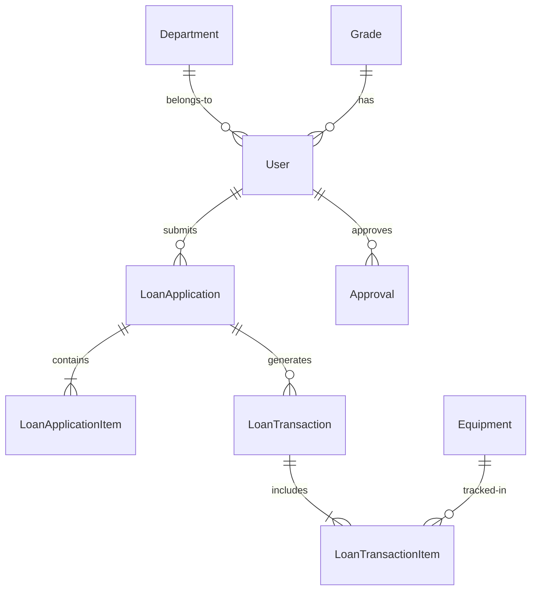

# Dokumentasi Aliran Sistem Permohonan Pinjaman Peralatan ICT

| Versi | Tarikh Kemaskini      | Jenis Dokumen                 | Sasaran                                 | Pematuhan Piawaian                |
|-------|-----------------------|-------------------------------|------------------------------------------|------------------------------------|
| 4.1   | September 2025        | Dokumentasi Aliran Teknikal   | Pembangun Sistem, Staf BPM, Pentadbir Sistem | Prinsip Reka Bentuk Kerajaan |

## Kandungan

- [Pengenalan](#pengenalan)
- [Seni Bina Sistem](#seni-bina-sistem)
- [Aliran Kerja Permohonan Pinjaman](#aliran-kerja-permohonan-pinjaman)
- [Pelaksanaan Teknikal](#pelaksanaan-teknikal)
- [Aliran Data dan Model](#aliran-data-dan-model)
- [Keselamatan dan Pematuhan](#keselamatan-dan-pematuhan)
- [Dokumentasi API](#dokumentasi-api)
- [Penerapan dan Operasi](#penerapan-dan-operasi)

## Pengenalan

### Purpose

The ICT Equipment Loan module manages the complete lifecycle of ICT equipment borrowing within MOTAC, from initial request through approval, issuance, usage tracking, and return processing.

### Key Objectives

- Streamlined Process: Digital transformation of paper-based loan forms
- Accountability: Complete audit trail for all transactions
- Resource Optimization: Real-time inventory tracking and availability
- Compliance: Adherence to government procurement and asset management policies

### System Benefits

| Benefit         | Description                                 | Impact                        |
|-----------------|---------------------------------------------|-------------------------------|
| Efficiency      | Reduced processing time from days to hours   | 70% faster processing         |
| Transparency    | Real-time status tracking for all stakeholders | 100% visibility               |
| Accuracy        | Automated validation and error prevention    | 95% error reduction           |
| Accessibility   | 24/7 access from any device                  | Increased user satisfaction   |

## Seni Bina Sistem

### High-Level Architecture

┌──────────────────────────────────────────────────────────────┐
│ User Interface Layer │
│ ┌────────────┐ ┌────────────┐ ┌────────────┐ │
│ │ Web App │ │Mobile View │ │ Admin │ │
│ │ (Livewire) │ │(Responsive)│ │ (Filament) │ │
│ └────────────┘ └────────────┘ └────────────┘ │
└──────────────────────────────────────────────────────────────┘
│
┌──────────────────────────────────────────────────────────────┐
│ Application Layer │
│ ┌────────────────────────────────────────────────────────┐ │
│ │ Laravel 12 Framework │ │
│ │ ┌──────────┐ ┌──────────┐ ┌──────────┐ │ │
│ │ │Controllers│ │ Services │ │ Models │ │ │
│ │ └──────────┘ └──────────┘ └──────────┘ │ │
│ └────────────────────────────────────────────────────────┘ │
└──────────────────────────────────────────────────────────────┘
│
┌──────────────────────────────────────────────────────────────┐
│ Data Layer │
│ ┌────────────────────────────────────────────────────────┐ │
│ │ MySQL Database │ │
│ │ ┌──────────┐ ┌──────────┐ ┌──────────┐ │ │
│ │ │ Loans │ │Equipment │ │ Users │ │ │
│ │ └──────────┘ └──────────┘ └──────────┘ │ │
│ └────────────────────────────────────────────────────────┘ │
└──────────────────────────────────────────────────────────────┘

### Component Architecture

LayerComponentsTechnologiesPresentationForms, Dashboards, ReportsBlade, Livewire 3Business LogicServices, Policies, ObserversLaravel 12, PHP 8.2+Data AccessModels, RepositoriesEloquent ORMInfrastructureQueue, Cache, StorageRedis, S3/Local

## Aliran Kerja Permohonan Pinjaman

### Complete Process Flow

```mermaid
stateDiagram-v2
[*] --> Draft: User starts application
Draft --> Submitted: Submit form
Submitted --> UnderReview: Auto-assign to approver
UnderReview --> Approved: Approve request
UnderReview --> Rejected: Reject request
Rejected --> [*]: End process
Approved --> ReadyForIssuance: BPM notified
ReadyForIssuance --> Issued: Equipment issued
Issued --> InUse: User receives equipment
InUse --> Returning: Return initiated
Returning --> Returned: Equipment checked in
Returned --> Completed: Process complete
Completed --> [*]: End process

    note right of UnderReview
        Approver must be
        Grade 41 or above
    end note


    note right of Issued
        Accessories checklist
        completed
    end note


### Detailed Process Steps

#### Phase 1: Application Submission

##### Step 1.1: Form Initialization

User accesses loan application form
System auto-populates user details
Dynamic form sections load based on user role


##### Step 1.2: Data Entry

```php
// Form structure based on official form
```

Section 1: Applicant Information

- Name (auto-filled)
- Position & Grade (auto-filled)
- Department/Unit (auto-filled)
- Purpose of loan
- Contact number
- Location of use
- Loan period (start/end dates)

Section 2: Responsible Officer

- [ ] Same as applicant
- Officer details (if different)

Section 3: Equipment Details

- Equipment type selection
- Quantity required
- Special requirements/notes

Section 4: Acknowledgments

- Terms and conditions acceptance
- Digital signature timestamp

#### Step 1.3: Validation & Submission

Real-time field validation
Business rule validation
Duplicate request checking
Submission confirmation

#### Phase 2: Approval Process

##### Step 2.1: Automatic Routing

```php
// Approval routing logic
if ($applicant->grade->level < 41) {
    $approver = $applicant->department->getApprover();
} else {
    $approver = $applicant->supervisor;
}
```

##### Step 2.2: Approver Actions

Review application details
Check equipment availability
Add comments/conditions
Approve/Reject decision

##### Step 2.3: Notification Distribution

EventRecipientsChannelSubmissionApplicantEmail + DashboardPending ApprovalApproverEmail + DashboardApprovedApplicant, BPMEmail + DashboardRejectedApplicantEmail + Dashboard

#### Phase 3: Equipment Issuance

##### Step 3.1: Inventory Check

Verify equipment availability
Reserve specific items
Generate issuance checklist

##### Step 3.2: Physical Handover

```yaml
Issuance Checklist:
    Main Equipment:
        - Model/Serial Number
        - Condition assessment
        - Functionality test
    Accessories:
        - Power adapter: [✓]
        - Carrying case: [✓]
        - Cables/peripherals: [✓]
        - Documentation: [✓]
    Signatures:
        - Issuing Officer: [Digital signature]
        - Recipient: [Digital signature]
        - Timestamp: [Auto-generated]
```

##### Step 3.3: Status Update

Equipment status → "On Loan"
Application status → "Issued"
Generate issuance receipt

#### Phase 4: Return Process

##### Step 4.1: Return Initiation

User/BPM initiates return
Schedule return appointment
Pre-return notification sent

##### Step 4.2: Equipment Inspection

```yaml
Return Checklist:
    Condition Assessment:
        - [ ] Good condition
        - [ ] Minor wear
        - [ ] Damage noted
        - [ ] Missing items
    Accessories Return:
        - Power adapter: [Status]
        - Carrying case: [Status]
        - Other items: [Status]
    Final Status:
        - [ ] Complete return
        - [ ] Partial return
        - [ ] Damage report required
```

##### Step 4.3: Process Completion

Update equipment status
Close loan application
Generate completion certificate
Archive transaction

## Pelaksanaan Teknikal

### Core Components

#### Controllers

```php
// Main controllers and their responsibilities
LoanApplicationController
├── index() - List applications
├── create() - Show application form
├── store() - Process new application
├── show() - Display application details
├── generatePDF() - Export to PDF
└── cancel() - Cancel application

LoanTransactionController
├── processIssuance() - Handle equipment issuance
├── processReturn() - Handle equipment return
├── getChecklistItems() - Retrieve checklist
└── updateStatus() - Update transaction status
```

#### Services

```php
// Service layer architecture
LoanApplicationService
├── createApplication($data)
├── validateApplication($application)
├── routeForApproval($application)
├── checkEquipmentAvailability($items)
└── generateApplicationNumber()

LoanTransactionService
├── processNewIssue($application, $equipment)
├── processExistingReturn($transaction, $condition)
├── validateAccessories($checklist)
└── calculateOverdueFees($transaction)
```

#### Livewire Components

```php
// Dynamic UI components
ResourceManagement\LoanApplication\ApplicationForm
├── mount() - Initialize form
├── updated($field) - Handle field changes
├── validateSection($section) - Section validation
├── submitApplication() - Process submission
└── saveDraft() - Auto-save functionality

ResourceManagement\Admin\BPM\ProcessIssuance
├── selectEquipment() - Equipment selection
├── validateChecklist() - Checklist validation
├── confirmIssuance() - Final confirmation
└── generateReceipt() - Receipt generation
```

### Database Schema

```sql
-- Core tables structure
loan_applications
├── id (primary key)
├── application_number (unique)
├── user_id (foreign key)
├── purpose (text)
├── location (varchar)
├── loan_start_date (date)
├── loan_end_date (date)
├── status (enum)
├── responsible_officer_id (foreign key)
├── supporting_officer_id (foreign key)
├── approved_by (foreign key)
├── approved_at (timestamp)
├── admin_notes (text)
└── timestamps

loan_application_items
├── id (primary key)
├── loan_application_id (foreign key)
├── equipment_type (varchar)
├── quantity_requested (integer)
├── quantity_approved (integer)
├── quantity_issued (integer)
└── quantity_returned (integer)

loan_transactions
├── id (primary key)
├── loan_application_id (foreign key)
├── type (enum: issue/return)
├── transaction_date (datetime)
├── accessories_checklist (json)
├── condition_notes (text)
└── signatures (json)
```

### Security Implementation

```php
// Policy-based authorization
class LoanApplicationPolicy
{
    public function create(User $user): bool
    {
        return $user->status === 'active'
            && $user->department_id !== null;
    }

    public function approve(User $user, LoanApplication $application): bool
    {
        return $user->grade->level >= 41
            && $user->department_id === $application->user->department_id;
    }

    public function issue(User $user): bool
    {
        return $user->hasRole('bpm-staff');
    }
}
```

## Aliran Data dan Model

### Entity Relationships



```text
LoanApplication {
    string status
    date loan_start_date
    date loan_end_date
    text purpose
}

Equipment {
    string asset_type
    string serial_number
    string status
    string condition
}
```

### State Transitions
<!-- Will convert to markdown table in a later step -->
Current StateActionNext StateConditionsDraftSubmitSubmittedAll required fields completedSubmittedAuto-routeUnder ReviewApprover identifiedUnder ReviewApproveApprovedApprover authorizedUnder ReviewRejectRejectedWith reasonApprovedProcessReady for IssuanceBPM acknowledgedReady for IssuanceIssueIssuedEquipment availableIssuedReturnReturningReturn initiatedReturningCompleteReturnedAll items checkedReturnedCloseCompletedProcess finalized

## Keselamatan dan Pematuhan

### Security Measures
<!-- Will convert to markdown table in a later step -->
LayerSecurity ControlImplementationAuthenticationMulti-factor authenticationLaravel Fortify with 2FAAuthorizationRole-based access controlSpatie Laravel PermissionData ProtectionEncryption at rest and in transitAES-256, TLS 1.3Audit TrailComprehensive activity loggingLaravel AuditingSession ManagementSecure session handlingRedis session driverInput ValidationServer-side validationForm Requests, Policies

### Compliance Standards

Kerajaan Principles Adherence

✅ User-Centric Design: Intuitive interface, minimal clicks
✅ Data-Driven Decisions: Analytics and reporting dashboard
✅ Structured Content: Organized form sections
✅ Appropriate Technology: Modern, scalable stack
✅ Minimalist Interface: Clean, focused design
✅ Consistency: Uniform patterns across modules
✅ Clear Navigation: Breadcrumbs, progress indicators
✅ Realistic Implementation: Based on actual workflows
✅ Cognitive Load Management: Progressive disclosure
✅ Flexibility: Configurable workflows
✅ Communication: Multi-channel notifications
✅ Hierarchical Structure: Clear approval chains
✅ Reusable Components: Official component library
✅ Typography Standards: Official typography system
✅ Smart Defaults: Pre-populated fields
✅ User Control: Granular permissions
✅ Error Prevention: Validation and confirmations
✅ Documentation: Comprehensive guides

## Dokumentasi API

### RESTful Endpoints

```yaml
Loan Applications:
    GET /api/loan-applications:
        description: List user's applications
        parameters:
            - status: filter by status
            - page: pagination
        response: ApplicationCollection
    POST /api/loan-applications:
        description: Create new application
        body: ApplicationRequest
        response: ApplicationResource
    GET /api/loan-applications/{id}:
        description: Get application details
        response: ApplicationResource
    PUT /api/loan-applications/{id}:
        description: Update application
        body: ApplicationUpdateRequest
        response: ApplicationResource
    POST /api/loan-applications/{id}/approve:
        description: Approve application
        body: ApprovalRequest
        response: ApprovalResource
Equipment:
    GET /api/equipment/available:
        description: List available equipment
        parameters:
            - category: filter by category
            - date_range: availability period
        response: EquipmentCollection
```

### Response Formats

```json
{
    "data": {
        "id": "LA-2025-09-00001",
        "status": "approved",
        "applicant": {
            "name": "John Doe",
            "department": "IT Department",
            "grade": "41"
        },
        "equipment": [
            {
                "type": "laptop",
                "quantity_requested": 2,
                "quantity_approved": 2
            }
        ],
        "loan_period": {
            "start": "2025-09-20",
            "end": "2025-09-27"
        }
    },
    "meta": {
        "timestamp": "2025-09-15T10:30:00Z",
        "version": "1.0"
    }
}
```

## Penerapan dan Operasi

### Environment Requirements

```yaml
Production Environment:
    Server:
        - OS: Ubuntu 22.04 LTS
        - CPU: 4 cores minimum
        - RAM: 8GB minimum
        - Storage: 100GB SSD
    Software:
        - PHP: 8.2+
        - MySQL: 8.0+
        - Redis: 7.0+
        - Nginx: 1.22+
        - Node.js: 18+
    Services:
        - Queue Worker: Supervisor
        - Cache: Redis
        - Session: Redis
        - Mail: SMTP/Mailgun
```

### Deployment Process

```bash
# Deployment checklist

1. Pre-deployment
     □ Backup current database
     □ Verify environment variables
     □ Run test suite

2. Deployment
     □ Pull latest code
     □ Install dependencies
     □ Run migrations
     □ Clear caches
     □ Restart services

3. Post-deployment
     □ Verify application health
     □ Check error logs
     □ Monitor performance metrics
     □ Generate deployment report
```

### Monitoring and Maintenance

```yaml
Monitoring Strategy:
    Application:
        - Response time < 200ms
        - Error rate < 0.1%
        - Uptime > 99.9%
    Database:
        - Query performance
        - Connection pool usage
        - Deadlock detection
    Infrastructure:
        - CPU usage < 70%
        - Memory usage < 80%
        - Disk usage < 85%
Maintenance Schedule:
    Daily:
        - Log rotation
        - Temporary file cleanup
        - Queue monitoring
    Weekly:
        - Database optimization
        - Security updates check
        - Backup verification
    Monthly:
        - Performance review
        - Security audit
        - Capacity planning
```

## Revision History

| Version | Date       | Author        | Changes                  |
|---------|------------|--------------|--------------------------|
| 4.1     | Sept 2025  | ICTServe Team| Compliance update        |
| 4.0     | Aug 2025   | ICTServe Team| Major workflow redesign  |
| 3.0     | Jun 2025   | ICTServe Team| Security enhancements    |
| 2.0     | Mar 2025   | ICTServe Team| Added approval workflow  |
| 1.0     | Jan 2025   | ICTServe Team| Initial release          |
